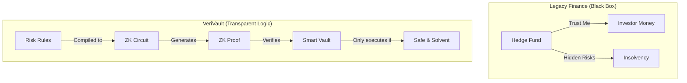
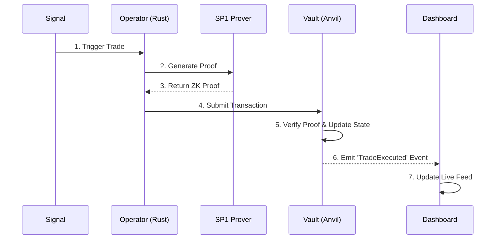

# VeriVault
**Proof of Solvent Execution**

VeriVault is a sovereign trading engine that mathematically guarantees a fund cannot cheat or go bankrupt due to hidden risks. Instead of trusting a black-box hedge fund, you trust a **Zero-Knowledge Circuit** that enforces risk limits on every single trade before it settles on-chain.

## Architecture

### The Problem vs The Solution


### Technical Execution Flow


---

## 🚀 Quick Start

### Prerequisites
- **Rust** (Nightly toolchain)
- **Foundry** (`anvil`, `forge`)
- **Node.js** (v18+)
- **SP1 Toolchain** (`sp1up`)

### 1. Start the Chain (Phase 2)
In a new terminal:
```bash
anvil --host 0.0.0.0 --port 8545
```

### 2. Deploy Contracts (Phase 2)
Deploy the `Vault` and `Verifier` to your local chain.
```bash
cd contracts
# Using default Anvil account 0
PRIVATE_KEY=0xac0974bec39a17e36ba4a6b4d238ff944bacb478cbed5efcae784d7bf4f2ff80 \
forge script script/Deploy.s.sol --rpc-url http://localhost:8545 --broadcast
```

### 3. Start the Dashboard (Phase 4)
Visualize the system state.
```bash
cd web
npm install
npm run dev
# Open http://localhost:3000
```

### 4. Run the Operator (Phase 1 & 3)
The "Brain" that generates trades and proofs.
```bash
# In the root 'verivault' directory
cargo run --release -p verivault-operator
```
*You will see it generate a proof and submit a transaction. The Dashboard will update instantly.*

---

## 🛠️ Components

| Phase | Component | Path | Description |
|-------|-----------|------|-------------|
| **1** | **Local Brain** | `core/`, `guest/` | The Rust Trading Logic and SP1 ZK Circuit. |
| **2** | **Sovereign Chain** | `contracts/` | The `Vault.sol` smart contract that holds funds and verifies proofs. |
| **3** | **Operator** | `operator/` | The off-chain service connecting the Brain to the Chain. |
| **4** | **Frontend** | `web/` | Next.js Dashboard ("Proof of Solvent Execution"). |

## Future Roadmap (Phase 5+)
- **Account Abstraction**: Replace EOA with Smart Accounts + Session Keys.
- **Real Markets**: Integrate Uniswap v4 Hooks for real liquidity.
- **Privacy**: Encrypt trade details using a Dark Pool architecture.
