# VeriVault System Flows & Architecture

## 1. Technical Execution Flow
This section details the exact function-to-function and service-to-service calls that occur during a lifecycle of a trade in VeriVault.

### Command Reference
| Component | Command | Description |
|-----------|---------|-------------|
| **Chain** | `anvil --port 8545` | Starts the local Polygon CDK/Validium simulation. |
| **Operator** | `cargo run -p verivault-operator` | Starts the Rust service that acts as the "Brain" and "Prover". |
| **Frontend** | `npm run dev` (in `web/`) | Starts the Dashboard to visualize on-chain state. |

### Detailed Call Graph (Sequence Diagram)

```mermaid
sequenceDiagram
    participant Trader as Mock Signal / Trader
    participant Op as Operator Service (Rust)
    participant Guest as SP1 Guest (RISC-V)
    participant Prover as SP1 Prover (Local)
    participant Chain as Vault.sol (Anvil)
    participant UI as Dashboard (Next.js)

    Note over Trader, UI: Step 1: Trade Signal Generation
    Trader->>Op: 1. trigger_trade(Buy, 1.0 ETH)
    Op->>Op: 2. Load Portfolio State (RiskParams, Balances)

    Note over Op, Prover: Step 2: Proof Generation (The "Brain")
    Op->>Prover: 3. client.prove(GuestELF, Inputs)
    Prover->>Guest: 4. Execute Guest Logic
    activate Guest
    Guest->>Guest: 5. verivault_core::check_risk()
    Guest->>Guest: 6. fixed::I64F64 Math Checks
    Guest-->>Prover: 7. Commit(PublicValues: [Hash, Success])
    deactivate Guest
    Prover-->>Op: 8. Return SP1Proof (Bytes)

    Note over Op, Chain: Step 3: Verification & Settlement
    Op->>Chain: 9. Vault.executeTrade(proof, public_values)
    Chain->>Chain: 10. SP1Verifier.verifyProof(proof, vkey)
    Chain->>Chain: 11. Decode PublicValues
    Chain->>Chain: 12. Update State / Emit "TradeExecuted"

    Note over Chain, UI: Step 4: Monitoring
    Chain-->>UI: 13. Event: TradeExecuted(user, success)
    UI->>UI: 14. Update Feed & TVL Display
```


---

## 2. The Pitch: "Proof of Solvent Execution"
**How to explain VeriVault to an Investor or Judge:**

*"VeriVault is a Sovereign Trading Engine that mathematically guarantees a fund cannot cheat or go bankrupt due to hidden risks. Instead of trusting a black-box hedge fund, you trust a Zero-Knowledge Circuit that enforces risk limits on every single trade before it settles on-chain."*

### Conceptual Architecture Diagram
```mermaid
graph TD
    subgraph "The Problem (Traditional Finance)"
        A[Hedge Fund (Black Box)] -->|Trust Me| B[Investor Money]
        A -->|Hidden Risks| C[Insolvency (FTX/3AC)]
    end

    subgraph " The Solution (VeriVault)"
        D[Risk Rules (Code)] -->|Compiled to| E[ZK Circuit]
        F[Trade Request] --> E
        E -->|Generates| G[ZK Proof]
        G -->|Verifies| H[Smart Contract Vault]
        
        style G fill:#0f0,stroke:#333,stroke-width:2px,color:black
        style H fill:#33f,stroke:#333,stroke-width:2px,color:white
        
        H -->|Only executes if| I[Solvent & Safe]
    end
```

**Key Value Props:**
1.  **Trustless**: Risk rules are enforced by math (ZK), not human promises.
2.  **Sovereign**: The Operator runs off-chain for speed/privacy, but settles on-chain for security.
3.  **Transparent**: The "Proof" is verifiable by anyone, anywhere.

---

## 3. Upgrade Roadmap
We have built the MVP (v1). Here is the path to v2 and beyond.


### Next Immediate Steps (v2)
1.  **Smart Accounts**: Replace the EOA (Private Key) in `verivault-operator` with a Kernel/Safe Smart Account.
2.  **Bundler Integration**: Send UserOps instead of raw Transactions.
3.  **Live Pricing**: detailed mocked price feeds with real historical data or a live API.
