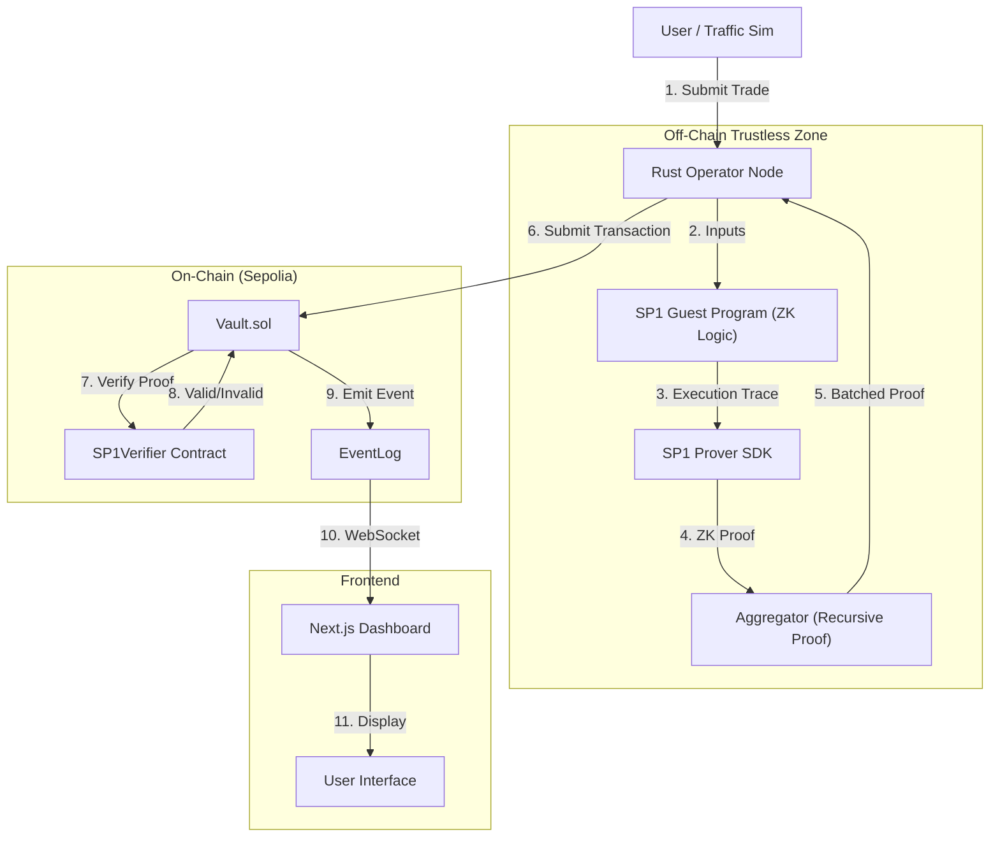

# VeriVault: Technical Architecture & System Flow

## 1. High-Level Architecture
VeriVault is a **Hybrid Exchange Architecture** (Hex) that combines the speed of off-chain matching with the security of on-chain ZK verification.

### System Diagram

---

## 2. Component Roles & Connections

### A. The Dashboard (`web/`)
*   **Tech**: Next.js 14, RainbowKit, Wagmi, TailwindCSS.
*   **Role**: The "Window" into the system.
*   **Connection**: 
    *   To User: Visual Interface.
    *   To Blockchain: READ-ONLY (via `useWatchContractEvent`).
    *   To Operator: None (Trustless Design - it doesn't trust the backend, only the chain).

### B. The Operator (`operator/`)
*   **Tech**: Rust, Tokio (Async), Alloy (Ethereum RPC).
*   **Role**: The "Engine" and Traffic Controller.
*   **Connection**:
    *   To Guest: FEEDS mock data/traffic for proving.
    *   To Aggregator: COORDINATES batching of multiple proofs.
    *   To Vault: WRITES transactions (pays gas).

### C. The Guest Program (`guest/`)
*   **Tech**: Rust (No-std), SP1 zkVM.
*   **Role**: The "Lawyer" / Logic Core.
*   **Connection**:
    *   Isolated environment. Receives inputs -> Outputs State. **Cannot access network.**

### D. The Host (`host/`)
*   **Tech**: Rust CLI.
*   **Role**: The "Test Bench".
*   **Connection**:
    *   Used for local development/debugging to run the Guest program without standing up the full Operator node.

### E. The Aggregator (`aggregator/`)
*   **Tech**: SP1 Recursion Circuit.
*   **Role**: The "Compressor".
*   **Connection**:
    *   Input: Multiple single-trade proofs.
    *   Output: One single "Meta-Proof" verifying that all inner proofs are valid.
    *   *Purpose: Reduces gas costs by submitting 1 proof for 1000 trades.*

### F. The Vault (`contracts/src/Vault.sol`)
*   **Tech**: Solidity, Foundry.
*   **Role**: The "Bank" / Custodian.
*   **Connection**:
    *   To Verifier: Calls `verifyProof` to check mathematical validity.
    *   To User: Holds funds and allows withdrawals.

---

## 3. Data Flow Example: A "Buy" Order 🔄

1.  **Initiation**: 
    The `run_demo_traffic.sh` script generates a "Buy 100 units" request.

2.  **Processing (Off-Chain)**: 
    The **Operator** loads the user's current state and sends it + the trade details to the **Guest Program**.

3.  **Proving (Zero-Knowledge)**: 
    The **SP1 Prover** watches the Guest Program execute. It generates a cryptographic proof (a hex string) that certifies: 
    *"I ran the code 'verivault-guest' on inputs X and Y, and the result was Valid."*

4.  **Aggregation (Optional/Batching)**:
    If high volume, the **Aggregator** takes 10 of these proofs and generates a single recursive proof to save gas.

5.  **Submission (On-Chain)**: 
    The Operator sends an Ethereum Transaction: `Vault.executeTrade(proof, public_values)`.

6.  **Verification**: 
    The `Vault.sol` calls `Verifier.verifyProof()`. 
    *   If correct: The Vault emits `TradeExecuted(user, success=true)`.
    *   If fake/invalid: The transaction reverts.

7.  **Updates**: 
    The **Dashboard** picks up the `TradeExecuted` event via RPC and shows "VERIFIED" to the user.
